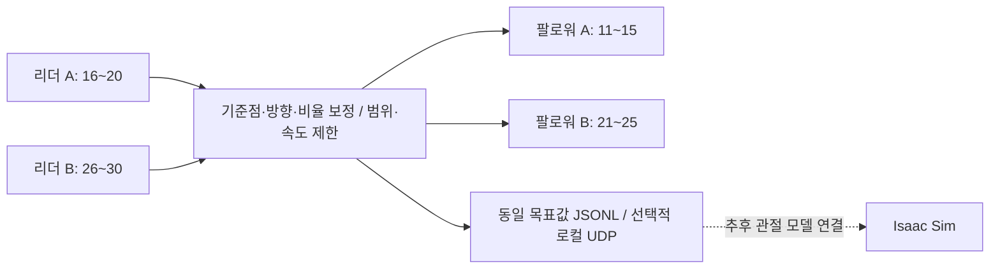

# 두 쌍의 매니퓰레이터 텔레오퍼레이션

실행 명령은 [START_HERE.md](START_HERE.md), 최종 연결·보정·구현 및 문제 해결 내역은 [2026-09-13 상세 기록](docs/implementation_record_2026-09-13.md)에 정리했습니다. 당시 코드와 설정 사본은 `docs/checkpoints/2026-09-13/`에 있습니다.

2026-09-13 작업 종료: 활성 18개 모터 토크 OFF 확인 후 통신 서비스도 종료했습니다. 종료 시점 최종 백업은 `docs/checkpoints/2026-09-13-final/`이며 이전 백업도 보존했습니다.

## 현재 실행 — A/B 동시

```bash
cd /home/jeonseongbin/Teleoperation
.venv/bin/python run_teleop.py
```

리더를 편한 시작 자세에 놓고 실행합니다. 팔로워들이 저장된 관절 기준점으로 최대 15°/s로 정렬한 뒤, 모두 도착하면 최대 180°/s 추종으로 전환합니다. 정렬 중에도 최신 리더 위치를 반영합니다. 갱신은 20 Hz이며 방향을 되돌리면 이전 목표를 취소합니다. 바뀐 관절 목표만 전송하여 다른 모터의 이동 프로파일을 불필요하게 재시작하지 않습니다.

현재 대상은 A의 16~20 → 11~15, B의 26~29 → 21~24입니다. **B 그리퍼 30·25번은 사용자의 하드웨어 문제 보고에 따라 읽기와 쓰기 모두 제외**했습니다. B 그리퍼를 나중에 연결하려면 열린/닫힌 위치를 보정하고 enabled를 켜야 합니다.

화면에 정렬/추종/대기/정지 이유, 현재 명령과의 차이, 리더 목표까지 남은 각도, 범위 끝에 닿은 모터를 표시합니다. `Ctrl+C`는 추종을 멈추고 자세를 유지합니다. 배경 서비스는 USB 연결과 토크를 유지합니다. 다시 실행하면 같은 서비스에서 재정렬하고 추종합니다. 장애물로 대기 중인 팔은 일반 실행 요청으로 대기가 해제되지 않습니다.

```bash
.venv/bin/python run_teleop.py --status
.venv/bin/python run_teleop.py --hold
.venv/bin/python run_teleop.py --pair A
.venv/bin/python run_teleop.py --pair B
```

팔로워가 막혀 내부 이동 궤적과 실제 위치 차이가 12°를 넘거나 지속적으로 움직이지 못하면 **해당 A/B 쌍만 자세 유지로 전환**합니다. 다른 쌍의 추종과 모든 리더 위치 읽기는 계속됩니다. 막힌 팔에는 멀어진 리더 목표를 누적하거나 반복 전송하지 않습니다. 별도의 접촉 센서가 없으므로 이는 위치 오차로 판단한 대기이며, 장애물 제거 여부를 자동으로 판별하지는 않습니다.

명령 없이 재개하는 방법은 두 가지입니다. 막힐 때 밀던 관절들의 리더 목표를 팔로워 정지 각도보다 반대쪽으로 2° 이상 되돌려 0.2초 유지하면 자동 재개합니다. 이때 나머지 관절까지 정확히 맞출 필요는 없습니다. 또는 리더를 대기 중인 팔로워와 같은 관절 자세에 가까이 맞추면(모든 관절 차이 3° 이내, 0.5초 유지) 재개합니다. 자동 재개는 느린 시작 정렬을 반복하지 않고 바로 일반 추종 속도(현재 최대 180°/s)를 사용합니다. 유지하던 목표에서 출발하며 주기별 이동량과 모터 가속 프로파일은 계속 적용됩니다. 처음 실행과 명시적인 `--resume` 요청은 기존 15°/s 정렬을 사용합니다. 대기 이후 리더 이동이 2°를 넘어야 자동 재개가 활성화됩니다. 반대로 움직였더라도 목표가 아직 장애물 쪽이면 대기를 유지합니다. 재개 중 다시 막히면 다시 해당 팔만 대기합니다.

리더를 되돌리지 않고 다른 자세로 재개하려면 장애물을 제거한 뒤 아래 명령을 사용할 수 있습니다. 선택한 팔만 현재 리더 자세로 저속 정렬하고, 다른 팔의 추종은 계속됩니다. 장애물을 치웠다는 사실만으로 자동 재개하지는 않습니다.

```bash
.venv/bin/python run_teleop.py --resume B
```

실행 중에는 자동 절전을 차단합니다. 노트북 강제 절전이나 USB 오류 뒤에는 상태를 확인하고 다시 실행해야 하며 자동으로 재구동하지 않습니다. 모터 전원이 끊기거나 토크가 해제되면 팔을 받쳐야 합니다.

## 저장된 보정과 실제 한계

A는 기존 일자 기준과 어깨 각도 보정을 사용합니다. A 어깨 P Gain 1200은 전원 재시작 후 토크 OFF 상태에서 복원합니다. B는 2026-09-13 사용자가 두 팔을 일자로 세워 확인한 기준과 동일한 축 방향/비율 1을 사용합니다. 링크 길이가 달라도 관절 각도 대응은 1:1입니다. B 베이스는 전기적 0점 경계를 양방향으로 통과하도록 확장 위치 모드와 저장된 원시 기준 좌표를 사용합니다.

- A 13번 모터에 저장된 위치 범위는 1024~3140입니다. 리더 18번이 대응 범위 밖으로 접히면 13번은 경계에서 유지합니다. 리더가 돌아오면 다시 따라갑니다.
- A 11번은 기존 소프트웨어 범위 548~1572(기준점 좌우 45°)가 남아 있습니다. B 21번은 일자 기준 양쪽 약 180°의 한 회전 범위를 사용합니다.
- 그리퍼/모터 범위 밖의 목표는 관절별로 제한합니다. 범위 초과만으로 전체 추종을 중단하지 않습니다. 이 범위는 충돌 없는 기구 동작을 보증하는 CAD 모델이 아닙니다.
- 정렬 도착 허용 오차는 5°입니다. 하중에 의한 잔류 오차가 이 안에 있으면 도착과 정체로 동시에 판정하지 않습니다. 실제 링크 각도를 완벽하게 일치시킨다는 의미는 아닙니다.
- 지속적인 미동작과 내부 궤적 추종 오차는 해당 팔만 대기시킵니다. 통신 오류, 150 ms 이상의 루프 지연, 모터 하드웨어 오류/과열, 큰 위치 불연속은 전체 추종 정지 사유로 표시합니다.

설정: `config/robot.json`. 상태: `work/teleop_status.json`. 제어 요청: `work/live_A_control.json`. 현재 세션 로그는 `work/live_A_service.jsonl`; 새 서비스는 `work/teleop_events.jsonl`에 기록합니다. 사용자가 A/B 모두 움직임과 복귀를 확인했습니다. 이후 느린 반응을 개선하기 위해 추종 속도를 180°/s, 속도 기반 Profile Acceleration을 50으로 올렸고 시간 기반 프로파일을 한 제어 주기부터 계산하도록 변경했습니다. 실제 궤적 추종 오차 감시는 유지합니다. 새 속도에서 체감 지연은 추가 확인이 필요합니다.

사용자가 새로 선택한 리더 시작 자세는 `config/start_pose.json`에 저장했습니다. 영점 보정은 변경하지 않았습니다. 실행 시에는 항상 실제 현재 리더 위치를 읽고 그 자세로 정렬합니다.

참고: [ROBOTIS OpenMANIPULATOR-X 텔레오퍼레이션](https://github.com/ROBOTIS-GIT/open_manipulator/blob/main/open_manipulator_teleop/open_manipulator_teleop/open_manipulator_x_teleop.py)의 최신 관절 목표 발행과 관절별 범위 처리를 참고했습니다. 원본은 키보드와 ROS 제어기를 사용하며, 이 프로젝트는 리더 엔코더와 DYNAMIXEL 직접 통신을 사용합니다.

아래는 초기 범용 CLI/보정 경로의 개발 기록입니다. 현재 실물 실행은 위의 `run_teleop.py`를 사용합니다.

---

리더 A(16~20) → 팔로워 A(11~15), 리더 B(26~30) → 팔로워 B(21~25)를 제어하는 Python 프로젝트입니다.
기본 실행은 모터를 움직이지 않습니다. 실제 구동은 관절 보정을 마치고 `--enable-motion`을 지정해야 시작합니다.

| 관절 | 리더 A → 팔로워 A | 리더 B → 팔로워 B |
|---|---|---|
| 1 | 16 → 11 | 26 → 21 |
| 2 | 17 → 12 | 27 → 22 |
| 3 | 18 → 13 | 28 → 23 |
| 4 | 19 → 14 | 29 → 24 |
| 5 | 20 → 15 | 30 → 25 |

관절 5는 그리퍼입니다. 현재 작업 대상은 A쌍이며, B쌍과 Isaac Sim은 추후 진행합니다.
`config/robot.json`의 `active_pair`가 A로 설정되어 있어 옵션을 생략하면 A쌍만 읽거나 제어합니다.
서로 다른 기구의 링크 길이·감속비·그리퍼 개폐 변환은 관절별 보정 또는 별도 변환이 필요합니다.



## 설치 및 현재 연결

이 폴더의 `.venv`에 설치되어 있습니다. 다른 환경에서는:

```bash
python3 -m venv .venv
.venv/bin/pip install -e '.[dev]'
```

설정은 `config/robot.json`입니다. 통신은 Protocol 2.0, 1 Mbps입니다.

| 설정 이름 | 현재 USB 연결 위치 | 보드 | ID |
|---|---|---|---|
| followers | usb-0:3.1:1.0 | OpenCR | 11~15, 21~25 |
| leader_end | usb-0:3.2:1.0 | OpenCR | 20, 30 |
| leader_small | usb-0:3.3:1.0 | OpenRB | 16~19, 26~29 |

OpenCR 두 대는 같은 USB 시리얼 번호를 보고하므로 `/dev/serial/by-id`로 구분할 수 없습니다.
그래서 `/dev/serial/by-path`를 사용하며, 허브 구멍을 바꾸면 설정의 `buses` 경로도 수정해야 합니다.
프로그램은 시작할 때 지정된 모든 ID와 모델 번호가 해당 포트에서 응답하는지 검증합니다.
두 OpenCR에는 공식 `usb_to_dxl` 중계 프로그램이 설치되어 있습니다.

## 1. 현재 상태 확인 — 모터 쓰기 없음

```bash
.venv/bin/teleop inspect --pair A --save work/inspection.json
.venv/bin/teleop monitor --duration 5 --jsonl work/observations.jsonl
```

`inspect`는 모델, 현재 위치, 전압, 온도, 토크, 제어 모드, 하드웨어 오류를 보여 줍니다.
`monitor`는 선택한 쌍의 관절을 연속 조회하며, 보정 없이 실행할 수 있습니다. 전체 점검은 `--pair both`로 지정합니다.
`work/initial_inspection.json`과 `work/observations.jsonl`은 이번 실물 점검 기록입니다.

2026-09-12 초기 점검에서는 모터 20개가 모두 응답했고, 토크는 전부 꺼져 있었습니다.
5초 연속 조회: 99회, 약 19.7 Hz, 가장 오래 걸린 전체 읽기 32.3 ms. 모터 쓰기 0회.

실제 구동 전에 해결할 항목:

- 11번 현재 위치 4110, 21번 -16: 토크 OFF 상태에서 단회전 경계를 넘은 위치값입니다.
- 13번 현재 위치 606, 저장된 위치 제한 1024~3140: 현재 자세가 기존 제한 밖입니다.
- 11·13·14·25번의 Drive Mode=4: 시간 기반 프로파일입니다. 현재 버전은 이 설정을 바꾸지 않고 시간 기반 프로파일도 지원합니다.
- 관절별 회전 방향, 실제 기구의 안전한 이동 범위, 기준 자세는 아직 보정하지 않았습니다.

위 수치는 점검 시점 값입니다. 프로그램은 EEPROM 모드/제한을 자동 변경하지 않습니다.
현재 설정에 맞는 안전한 자세와 제어 설정을 확인한 뒤 보정해야 합니다.
원시 위치는 raw_position으로 보존합니다. 팔로워가 모드 3이며 토크 OFF일 때는 토크 ON 후 사용할 절대 위치를 별도로 계산하여 같은 물리적 자세에 목표를 맞춥니다.
이 처리는 0/4095 경계를 넘어가는 목표 경로를 허용하지 않습니다.

## 2. 관절 보정 — 설정 파일만 변경

팔을 받친 상태에서 토크 OFF인 리더와 팔로워를 서로 대응하는 기준 자세로 맞춥니다.
관절의 양 끝까지 힘으로 밀지 말고, 기구에서 확인한 범위 안에서만 움직이세요.
아래 명령의 `--poses-aligned`는 자세를 실제로 맞췄다는 뜻입니다.

```bash
.venv/bin/teleop capture-neutral --pair A --poses-aligned
```

기준점은 저장되지만 구동 허용 상태가 되지는 않습니다.
보정에는 다음 항목이 필요합니다:

- `direction`: 리더 값 증가가 팔로워 값 증가에 대응하면 1, 감소에 대응하면 -1.
- `scale`: 리더 모터 축 변화량에 대한 팔로워 모터 축 변화량의 비율.
- `leader-range`: 리더 기준점에 대한 확인된 최소/최대 모터 축 각도(도).
- `follower-range`: 팔로워 기준점에 대한 확인된 최소/최대 모터 축 각도(도).

각도를 확인한 후 팔 관절 1~4에 `set-joint`로 기록합니다. 다음은 **형식 설명용 예시**이며,
±20°를 실제 기구의 안전 범위로 간주하면 안 됩니다.

```bash
.venv/bin/teleop set-joint --pair A --joint 1 --direction 1 --scale 1 \
  --leader-range -20 20 --follower-range -20 20 --reviewed
```

현재는 A의 팔 관절 1~4를 보정합니다. 기준점 재기록 시 팔 관절의 `reviewed`는 다시 false가 됩니다. 그리퍼는 아래 열린/닫힌 위치를 별도로 기록합니다.
보정 뒤 모터의 모델/모드/Drive Mode/Homing Offset이 바뀌면 재보정 없이는 실행되지 않습니다.

변환식:

`팔로워 목표 = 팔로워 기준점 + 방향 × 비율 × (리더 현재 위치 − 리더 기준점)`

리더는 0/4095 경계에서의 작은 변화를 이어서 읽습니다. 이 버전의 리더 가동 범위는 기준점 ±180° 미만입니다.
팔로워는 기본적으로 단회전 위치 제어(모드 3)를 사용하며, 모터에 저장된 위치 제한과 기구에서 확인한 범위 둘 다 적용합니다.
명시적으로 전환한 확장 위치 모드(4)는 좁은 소프트웨어 범위 설정이 추가로 필요하며, 그 범위와 기구에서 확인한 범위를 적용합니다.
범위를 넘는 팔로워 목표는 한계값으로 제한하고, 리더가 보정된 입력 범위를 벗어나면 중지합니다.

## 그리퍼의 개폐 위치 기록

A 그리퍼의 닫힘/열림 기록은 완료했습니다. 상세 값은 `docs/calibration_A.md`에 있습니다.
다시 기록하려면 두 그리퍼를 같은 개폐 상태로 맞춘 뒤 다음 명령을 사용합니다.

```bash
.venv/bin/teleop capture-gripper --pair A --state closed --poses-set
.venv/bin/teleop capture-gripper --pair A --state open --poses-set --reviewed
```

비율은 관절각 1:1과 별도로, 각 그리퍼의 열린/닫힌 모터 위치를 기준으로 자동 계산합니다.

## 팔로워의 현재 자세만 유지

두 팔을 계속 손으로 받치기 어려울 때 팔로워만 현재 자세에 고정할 수 있습니다.
팔로워 A를 받친 상태에서 다음 명령을 실행하면 **11~15번의 토크가 켜집니다.**
리더 16~20번에는 쓰지 않으며, 리더 움직임을 따라가는 동작도 하지 않습니다.

```bash
.venv/bin/teleop hold --pair A --enable-hold --duration 30 --jsonl work/hold_A.jsonl
```

현재 위치가 모터에 저장된 제한 밖이면 시작하지 않습니다.
현재 위치를 목표로 먼저 입력하고 토크를 켭니다. 시간 기반/속도 기반 프로파일은 각 모터의 기존 설정에 맞게 계산합니다.
종료 시 토크를 자동 해제하지 않습니다. 팔을 받치지 않은 상태에서 전원이나 토크를 끄면 팔이 내려갈 수 있습니다.

유지 프로그램을 재시작해야 할 때는 기존 목표에 도착해 있는 모터에 한해 `hold --resume-hold`를 사용할 수 있습니다.
이 옵션도 `--enable-hold`가 필요하며, 모든 팔로워가 위치 모드·토크 ON이고 기존 목표와 현재 위치가
8 tick 이내인지 검사합니다. 토크와 기존 목표를 유지한 채 통신 감시 타이머만 설정합니다.
종료와 재연결 사이에 통신 감시 오류가 생겼다면, 원인을 확인한 뒤에만 `--recover-watchdog`를 명시합니다.
기본 동작은 오류를 해제하지 않습니다. 이 기능은 추종 재개가 아닌 현재 자세 유지 전용입니다.
유지 기록의 `motors`에는 리더와 팔로워의 위치·목표·전압·온도·토크·오류가 함께 포함됩니다.

관절 방향을 현장에서 관찰할 때만 `hold --resume-hold`에 `--jog-joint`(1~4)와 `--jog-degrees`를
함께 지정할 수 있습니다. 이동 공간을 확인하고 한 관절을 관찰하며 사용합니다.
한 번에 최대 3°, 최대 2°/s이며 기존 모터 위치 제한과 이미 확인된 소프트웨어 제한을 적용합니다.
이동하지 않는 관절도 8 tick 이내로 유지되는지 확인합니다. 5초 안에 목표에 도착하지 않으면 중지합니다.
이 동작은 확인한 관절 방향을 자동 저장하거나 미확인된 텔레오퍼레이션을 허용하지 않습니다.

### 한 관절의 원점 좌표 변경

모터 원점 변경은 자세를 지지한 뒤에만 수행하는 별도 유지보수 기능입니다.
`hold --resume-hold`에 `--home-joint`, `--home-offset`, `--supported`를 함께 지정합니다.
`--enable-hold`가 필요하며, 기존 통신 감시 오류가 확인되었다면 `--recover-watchdog`도 명시합니다.
설정과 모터 상태를 `work/backups`에 백업하고 대상 관절만 토크를 끈 뒤 Homing Offset을 기록·검증합니다.
보정 기준점에도 같은 차이를 더하고 실제 현재 위치를 목표로 설정한 뒤 토크를 복귀합니다.
다른 팔로워는 계속 유지합니다. 이동 명령이나 모드 변경을 위한 기능이 아닙니다.
중간에 위치가 움직이거나 설정 검증이 실패하면 대상 관절의 토크 OFF를 시도하며 자동으로 다시 켜지 않습니다.
실패 시 팔을 계속 받친 상태에서 백업과 실제 설정을 확인해야 합니다.
일반 모터 쓰기 경로는 계속 EEPROM 쓰기를 금지합니다. 원점 변경은 이 별도 경로의 주소 20에만 한정됩니다.
원점 변경이 성공해도 기구 이동 범위를 검증한 것은 아니므로 `reviewed=false`입니다.

### A 베이스의 확장 위치 모드

`hold --resume-hold --extended-base --supported`는 11번만 모드3에서 모드4로 전환하는 유지보수 기능입니다.
`--enable-hold`도 필요합니다. 베이스를 받친 상태에서만 실행하고, 대상 토크를 잠깐 끈 뒤 현재 자세로 복귀합니다.
백업 후 작동 모드와 보정 서명을 함께 갱신하고 초기 범위를 기준점 좌우45°로 제한합니다.
모드4는 EEPROM 위치 제한을 사용하지 않으므로 모든 목표 쓰기에 이 소프트웨어 범위를 강제합니다.
처음 읽을 때만 회전수 차이를 계산해 좌표를 대응시키며, 세션 중 위치 점프를 자동 재보정하지 않습니다.
구동 중 측정값이 범위를 벗어나면 중지합니다. 재시작 시 현재 자세가 초기 범위 밖이어도 자동으로 이동시키지 않습니다.
모드 변경 실패 시 대상 토크 OFF를 시도합니다. 다른 팔로워는 계속 유지하므로 사용자 지지 상태에서 복구가 필요합니다.
이 기능은 정렬이나 추종을 자동 시작하지 않습니다.

## 3. 추종 계산 확인 — 보정 완료 후, 모터 쓰기 없음

현재 설정은 `startup_mode: align`입니다. 리더를 편하게 안정된 자세에 두고 시작하면,
팔로워는 자신의 시작 위치에서 **최대 5°/s로 리더의 시작 관절 자세까지 정렬**한 뒤 추종합니다.
일자로 맞춘 기준점은 최초 보정에 쓰며, 매 실행 때 일자로 세울 필요는 없습니다.
관절각을 대응하므로 링크 길이가 다르면 끝점 위치는 달라집니다.

정렬 목표는 시작할 때 한 번 읽어 고정합니다. 정렬 중 리더는 그대로 두세요.
리더가 시작 위치에서 2°를 넘게 움직이면 중지합니다. 그리퍼도 저장된 개폐 구간으로 정렬합니다.
목표가 팔로워 보정 범위 밖이면 정렬을 시작하지 않습니다. 정렬 중 범위·속도·통신·추종 오차 검사도 유지합니다.
모든 목표 갱신이 끝나고 실제 위치가 목표에서 2° 이내인 상태를 3회 연속 확인한 뒤 추종으로 전환합니다.
정렬 제한 시간은 60초입니다. JSONL의 `phase`는 `aligning` 또는 `following`입니다.

기존 자세 일치 검사 방식은 `--startup matched`로 선택할 수 있습니다.
`--startup align`으로 정렬 방식을 명시할 수도 있습니다. 방향과 기구 이동 범위 보정은 두 방식 모두 필요합니다.

```bash
.venv/bin/teleop run --pair A --duration 10 --jsonl work/dry_run_A.jsonl
.venv/bin/teleop run --pair both --duration 10 --jsonl work/dry_run_both.jsonl
```

`run` 기본값은 dry-run입니다. 실제 팔로워가 움직이지 않으므로 이 모드에서는 팔로워 추종 오차 검사를 생략합니다.
정렬 도착도 계산된 목표의 도착으로 대신 판단합니다. 따라서 dry-run 완료는 실물 정렬 성공을 의미하지 않습니다.
기준 위치/범위/방향 등 다른 보정 검사는 그대로 적용됩니다.

## 4. 실제 추종 — 보정 및 기구 확인 후에만 실행

아래 명령은 **팔로워 토크를 켜고 실제로 움직입니다.** 시작 전 모든 선택된 리더/팔로워 토크가 OFF여야 합니다.
중력으로 움직일 수 있는 팔을 받치고, 전원 차단에 바로 접근할 수 있는 상태에서 먼저 A만 짧게 확인합니다.
별도의 `hold`가 실행 중이면 이 명령으로 바로 전환할 수 없습니다. 실행 중인 유지 동작을 임의로 종료하거나
토크를 해제하지 마세요. 현재 자세 유지에서 추종으로 직접 전환하는 기능은 아직 없습니다.

```bash
.venv/bin/teleop run --pair A --duration 5 --enable-motion --jsonl work/live_A.jsonl
.venv/bin/teleop run --pair both --enable-motion --jsonl work/live_both.jsonl
```

- 기본 목표 갱신 20 Hz, 정렬 속도 최대 5°/s, 정렬 후 추종 속도 최대 15°/s.
  `matched` 시작 방식은 시작 자세 허용 오차 5°를 적용합니다.
- 목표를 현재 위치로 먼저 설정하고, 위치가 유지되는지 확인한 뒤 팔로워 토크를 켭니다.
- 팔로워 RAM의 Profile Acceleration, Profile Velocity, Goal Position, Bus Watchdog, Torque Enable만 씁니다.
- 리더에는 구동/토크 명령을 보내지 않습니다. 리더 토크가 켜져 있으면 시작하지 않습니다.
- 통신 누락, 150 ms 루프 지연, 하드웨어 오류, 과열, 설정된 전압 한계 이탈, 급격한 리더 변화,
  추종 오차 초과 시 새 목표 전송을 중지합니다. 일부 모터 데이터만으로 계속 움직이지 않습니다.
- 실물 구동 시 팔로워에 300 ms Bus Watchdog을 설정합니다. 이 기능은 인증된 비상정지 장치를 대신하지 않습니다.
- Ctrl+C/SIGTERM/오류/지정 시간 종료 시 현재 위치 유지 명령을 시도합니다. 토크는 자동 해제하지 않습니다.
  전원이 끊기거나 토크를 해제하면 팔이 중력으로 내려갈 수 있습니다.
- 통신 자체가 끊기면 위치 유지 명령도 전달하지 못할 수 있습니다. 남아 있는 목표/모터 watchdog에 의존합니다.
  종료 후 watchdog 오류가 남을 수 있으므로 상태를 확인하고 수동으로 복구해야 재실행할 수 있습니다.
- 종료 후 프로파일과 watchdog RAM 값은 남습니다. 기존 값을 자동 복원하거나 watchdog 오류를 자동 지우지 않습니다.

위 내용은 초기 범용 CLI 경로입니다. 현재 실물 A 추종은 문서 맨 위의 `run_A.py` 경로를 사용합니다.

## Isaac Sim 확장 — 현재 작업 범위에서 보류

동일한 제한된 팔로워 목표값을 JSONL 또는 선택적 localhost UDP로 내보냅니다.

```bash
.venv/bin/teleop run --pair both --jsonl work/targets.jsonl --udp-port 8765
```

실물 추종과 함께 송신하려면 보정 완료 후 `--enable-motion`을 추가합니다.
현재 구현에는 Isaac Sim 장면 생성이나 articulation 제어가 포함되어 있지 않습니다.
자세한 메시지 형식과 이후 필요한 URDF/관절 매핑은 `docs/simulation.md`에 있습니다.

## 테스트

```bash
.venv/bin/python -m pytest -q
```

테스트는 실제 USB 장치에 접근하지 않습니다. A/B 매핑, 방향/비율, 엔코더 경계,
속도/범위 제한, 잘못된 보정, 통신 실패, 읽기 모드의 쓰기 금지, 실물/시뮬레이션 목표 일치를 검증합니다.

공식 참고 문서: [DYNAMIXEL SDK Sync Read/Write](https://emanual.robotis.com/docs/en/software/dynamixel/dynamixel_sdk/sample_code/python_sync_read_write_protocol_2_0/),
[XL430 제어 테이블](https://emanual.robotis.com/docs/en/dxl/x/xl430-w250/),
[XL330 제어 테이블](https://emanual.robotis.com/docs/en/dxl/x/xl330-m288/).
